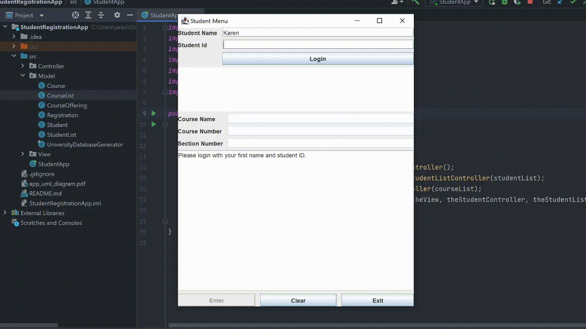
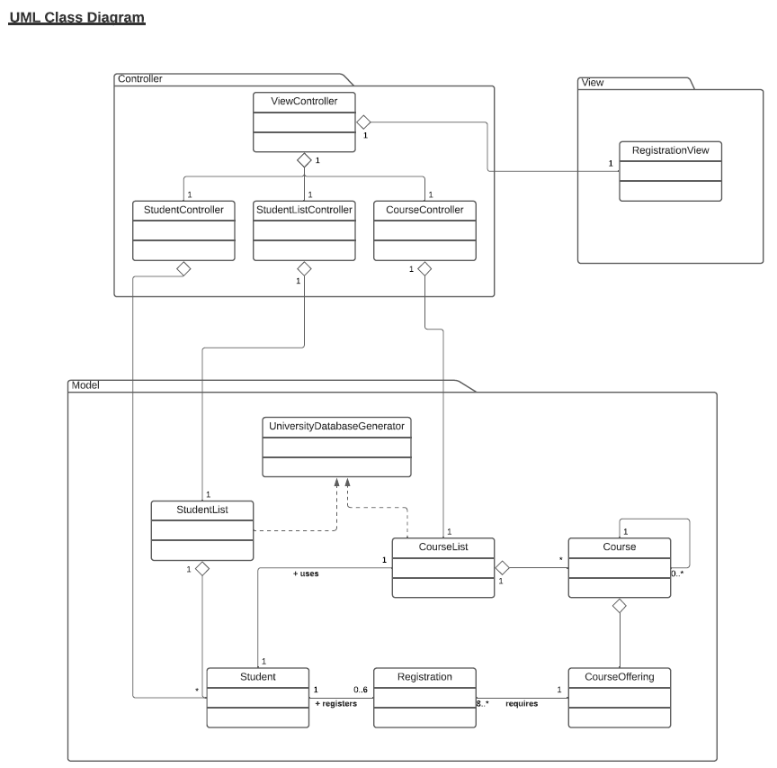

# ENSF 607 Project - StudentRegistrationApp

The Student Registration App is a model of an application that students at a given school could use to register for classes. This app uses an MVC design pattern with a simple GUI. A student enters their name and student number which is varified by the app before they are allowed to register. Once they are authenticated, a student will find and select the course and offering section they would like to enroll in. 

The app contains the following menu features:
1. Search for a course
2. Register for a course
3. Unregister for a course
4. View all the coruses a student has registered for
5. List all courses offered by the school

The app verifies the following conditions:
1. The course and section, that the student is registering for, exists.
2. The student has the required prerequisites for the course they are trying to enroll in.
3. The student does not enroll in more than 6 courses.
4. The student does not enroll in the same course twice.

# UML Diagram

# Contributors
* [Graydon Hall](https://github.com/GraydonHall42)
* [Jared Kraus](https://github.com/JaredKraus)
